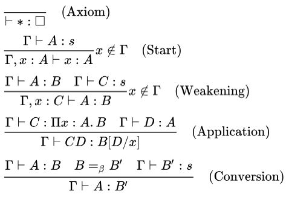
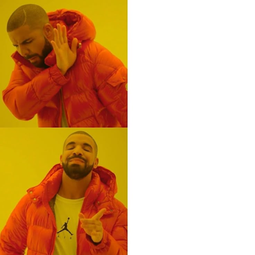

# Дырявое решето типов

Разбираемся с отношением подтипов в TypeScript

<!--
Всех приветствую на моём докладе "Дырявое решето типов" или "Разбираемся с отношением подтипов в TypeScript". Почему именно такое название, поймёте в ходе доклада.
-->

---
level: 2
hideInToc: true
---

# Приятно познакомиться

- Василий Алфертьев
- Frontend разработчик (React + TypeScript)
- Компания: Открытые решения
- Telegram: @alfertev2012
- GitHub: alfertev2014

<!--
Сперва, кто я такой. Я Василий Алфертьев, в настоящее время работаю frontend-разработчиком в компании Открытые решения, пишу на React-е, активно использую TypeScript в работе. Ничего особенного, делаю интерфейсы различных одностраничных приложений.
-->

---
layout: two-cols-header
level: 2
hideInToc: true
---

# Чем ещё владею

::left::

- 5+ лет в **С++**:
  - системное программирование в Linux
  - UI на Qt
- ~6 лет в **Java**:
  - backend на Spring
  - базы данных
  - монолиты, микросервисы…

::right::

- Увлекаюсь
  - дизайном языков программирования
  - best practices и архитектурой ПО
  - математической логикой
- **Фанат систем типов**
- Тянет разбираться в
  - компиляторах и оптимизациях
  - "кишках" runtime разных языков
  - IDE и инструментах
  - LISP, Prolog, OCaml, Haskell, Scala…

<!--
Когда-то занимался системным программированием на C++, писал UI на Qt, прошёл через backend-разработку на Java. Параллельно увлекался изучением вопросов дизайна языков программирования, математическими основами, которые за ними стоят... Фанат систем типов. Люблю поинтересоваться, как устроены компиляторы, IDE и другие инструменты.

И вот с этим опытом я пришёл во frontend-разработку, возлагая на TypeScript определённые надежды. Какое-то время я просто наблюдал за его развитием, а потом решил, что всё, пора.
-->
---
layout: default
dragPos:
  tapl: 632,100,300,_
  typing_rules: 107,214,487,_
  complex_type1: 74,206,803,_
  complex_type2: 93,309,800,_
  mortal_combat: 246,223,516,_
  typescript_is_bad: 210,289,198,_
  bad_ts: 431,317,428,_
  prototype_chain: 462,122,381,_
  proxy: 212,342,238,_
  devid: 572,334,271,_
  tsgo: 475,105,464,_
  tsgo_link: 33,370,439,_
---

# Вокруг TypeScript много интересного

<div v-click="[1, 2]">
  
  
</div>
<div v-click="[2, 3]">
  
  
</div>
<div v-click="[3, 4]">
  
</div>
<div v-click="[4, 5]">
  
  <div v-drag="'bad_ts'">
    <p>Why TypeScript is Bad</p>
    <p><a href="https://t.me/why_typescript_is_bad">https://t.me/why_typescript_is_bad</a></p>
  </div>
</div>
<div v-click="[5, 6]">
  
  
  
</div>
<div v-click="[6, 7]">
  
  <div v-drag="'tsgo_link'">
    <p><a href="https://github.com/microsoft/typescript-go">https://github.com/microsoft/typescript-go</a></p>
  </div>
</div>

<v-clicks>

- Погружение в теорию типов
- Программирование на типах
- Сравнение статической типизации с динамической
- Метапрограммирование на прототипах и Proxy
- Разбор *всех* проблем TypeScript
- Миграция tsc на Go

</v-clicks>

<!--
Потому что в TypeScript много чего удивительного, несмотря на кажущуюся простоту.

1. Это и мощная система типов, за которой стоят хитрые математические основы. И в них тоже бывает полезно погрузиться. Здесь я приведу книгу Бенжамина Пирса "Типы в языках программирования", где даётся хорошее введение в теорию типов, математическим языком рассматриваются системы типов от самых простых до применяемых на практике в современных языках программирования.

2. И система типов TypeScript достаточно мудрёная, что можно на типах даже программировать, используя тайпчекер как интерпретатор. Иногда это может быть полезно для описания подробных спецификаций для кода со сложными утверждениями, доказательством которых занимается тайпчекер. Для более простых повседневных кейсов это про утилитные типы, которые могут быть довольно сложными.

3. Вечный холивар, нужны ли типы вообще при существовании языков с динамической типизацией, на которых в короткие сроки можно писать рабочие приложения.

4. А также, вспомним, какую динамическую природу имеют объекты в JavaScript. В сочетании с механизмами прототипного наследования и прокси есть возможности творить очень хитрое метапрограммирование, "особое уличное". И тут в отношении TypeScript тоже становится интересно, как статической типизации сосуществовать со всей этой динамической магией.

5. Несмотря на мощную теорию и многообещающие возможности, TypeScript имеет много изъянов, о которых тоже стоит знать и иметь ввиду.

6. Также, про TypeScript есть много разных новостей. Например, вот недавний хайп про переписывание компилятора на Go.

7. Так вот, всего этого сегодня в докладе не будет.
-->

---
layout: default
hideInToc: true
---

# План доклада

1. Проблема строгого языка
1. Коротко про TypeScript и его систему типов
1. Проблемы отношения подтипов в TypeScript на примерах
1. Возможные пути решения
1. Заключение

<!--
Сегодня я хочу поговорить о чём-то более конкретном, а именно, про некоторые проблемы системы типов TypeScript, которые не позволяют языку быть достаточно надёжным и строгим. Разберём, что такое отношение подтипов и какие с ним связаны проблемы на примерах. И в конце подумаем, что с этим можно сделать.
-->
---
layout: section
---

# Проблема строгого языка

В динамической среде исполнения

<!--
Итак, строгий язык со статической типизацией, а среда исполнения динамическая. Как с этим быть?
-->
---
layout: default
level: 2
dragPos:
  drake: 98,38,439,_
  cwa_owa: 382,334,417,_
  stat_dyn: 370,132,474,30
---


<div v-drag="'stat_dyn'">Статическая/динамическая типизация</div>
<div v-drag="'cwa_owa'">Closed/Open World Assumptions</div>

<!--
И всё-таки пару слов про статическую типизацию против динамической. Я предпочитаю заострять внимание немного на другом моменте.
-->
---
level: 2
layout: image-right
image: ./images/cwa.png
---

# Closed World Assumption

- *Полная* информация о поведении программы
- Нет *непредсказуемых* динамических изменений в среде исполнения
- Можно вести рассуждения об исполнении *статически*

<!--
Есть в мире разработки компиляторов такой термин как Closed World Assumption или предположение о "закрытом мире". Это когда вся среда исполнения программы находится под контролем, закрыта от динамических изменений, предсказуема, работает как часы, и можно вести очень сложные рассуждения с сильными доказательствами статически, ещё до запуска программы, просто глядя на код.

Если вы разрабатываете программную систему или какой-то её фрагмент, модуль, с таким предположением, то здесь хорошо заходит статическая типизация.

Обычно это предположение требуется при написании прикладного кода. При разработке приложения целиком формулировка требований предполагает предсказуемость поведения.
-->
---
level: 2
layout: image-right
image: ./images/owa.png
---

# Open World Assumption

- Динамическая загрузка модулей
- Неявное влияние модулей друг на друга через runtime
- Динамическое применение конфигураций
- eval и интерпретаторы

<!--
В противовес существует Open World Assumption, это когда среда исполнения открыта для динамической загрузки кода, меняется на ходу при изменении конфигураций или, вообще, содержит реализацию интерпретатора другого языка или просто функцию eval. JavaScript-runtime именно такой.

И в таких случаях для обеспечения надёжности ничего не поделать, придётся вставлять в код динамические проверки.

Обычно с Open World Assumption приходится иметь дело библиотечному коду. Библиотеки обычно не знают, в каких кейсах будут использоваться и в каком окружении исполняться.

Но чаще всего применяется сочетание двух предположений. Программная система может состоять из модулей. Каждый модуть сам по себе может рассматриваться закрытым, а вот код, который связывает все модули воедино, динамически загружая их в среду исполнения, предполагает открытый мир.

О том, что на TypeScript трудно писать библиотечный код, был доклад на прошлом holy.
-->
---
level: 2
title: Проблема
layout: default
---

## Задача

<br/>

- Задействовать возможности TypeScript для ужесточения языка **прикладного кода**, используя типы как **_спецификацию_**.

<v-click>

## Проблема

<br/>

- Система типов TypeScript имеет **существенные недостатки**, не позволяющие обеспечить строгие гарантии.

</v-click>

<!--
Так вот, в докладе мы будем предполагать, что статическая типизация нам нужна, что мы пишем прикладной код в определённом стиле - без динамической магии, в удобном для статического анализа - и хотим использовать типы по максимуму почти как формальную спецификацию. Тайпчекер проверял бы для нас, чтобы поведение программы придерживалось строго определённой схемы, и при редактировании кода многие потенциальные ошибки сразу были бы видны для программиста во время компиляции.

1. А проблема в том, что TypeScript как он есть для этой задачи тоже не подходит. Есть существенные недостатки в самом фундаменте системы типов, о которых мы сейчас и поговорим и подумаем, что с этим можно сделать.

На момент, когда я задумался об этих проблемах и стал копать в эту сторону, я уже разрабатывал большие приложения на TypeScript более трёх лет, наивно полагая, что TypeScript ведёт себя так, как я себе представляю, не подозревая о подобных граблях. И я представил, сколько может быть ещё разработчиков, освоивших TypeScript для коммерческой разработки, которые тоже не подозревают об этих моментах. На конференциях почему-то об этом мало говорят. 
-->

---
level: 2
layout: default
---

# А так хотелось рассказать...

- Типы как спецификация строгих DSL
- Зависимые типы и вычисления на типах
- Верификация программ
- Оптимизирующие компиляторы с информацией о типах
- Система доказательств теорем на типах

<!--
На самом деле, так хотелось рассказать сегодня о другом. Я думал готовить доклад на более серьёзные хардкорные темы, связанные с типизацией, рассуждением о программах, доказательсвом их корректности и использованию этих доказательств для хардкорных оптимизаций. А потом как открыл для себя, что TypeScript мягко говоря, "дырявый" в самых своих основах, что рассмотрение таких тем выглядит уже каким-то бессмысленным, на мой взгляд.
-->
---
level: 2
layout: default
dragPos:
  dreaming_girl: 174,87,655,_
  ocaml1: 30,324,346,_
  ocaml2: 29,258,344,_
---


<!--
Я вообще какое-то время держался за идею, что на TypeScript можно писать в том же стиле, как на OCaml-e, получая все те же преимущества функциональных языков со строгой типизацией и не писать unit-тесты на то, что и так проверяется типами. Но в случае TypeScript тщательно покрывать код unit-тестами - всё ещё актурально.
-->

---
level: 2
layout: default
---

# DISCLAIMER

- Спикер не призывает к обязательному использованию TypeScript или других способов статической типизации для JavaScript.
- Спикер не ставит целью показать причины, по которым стоит отказаться от TypeScript.
- Спикер понимает, что можно писать надёжно и продуктивно и на JavaScript без типов.

<!--
Должен сказать, что я хоть и сторонник статической типизации, но не считаю, что надо лепить TypeScript везде, где только можно, любой ценой и не задумываясь.

Также, я хоть и собираюсь сейчас в докладе ругать TypeScript за его недостатки, я не призываю отказываться от него, давать кому-то лишний повод сказать, что "типы не нужны".

В то же время, я понимаю, что на JavaScript можно и без типов писать надёжно и продуктивно, придерживаясь особых соглашений и best practices.
-->
---
layout: section
---

# Коротко про TypeScript

И его систему типов

<!--
Вспомним быстро, что из себя представляет TypeScript
-->
---
layout: section
---

# Плюсы и минусы

<!--
и немного про надёжность его системы типов.
-->
---
layout: default
dragPos:
  ts_logo: 640,113,220,_
  microsoft: 648,383,209,_
---

# Коротко про TypeScript

- Язык программирования
- Синтаксис основан на JavaScript
- Транспиляция в JavaScript
- Проверка типов
- Поддержка IDE (language server)


<!--
Итак, TypeScript - это язык программирования с синтаксисом, основанным на JavaScript, он транспилируется в JavaScript с минимальными изменениями кода (в идеале - происходит просто "стирание" типов). Основной фишкой его фишкой выступает тайпчекер, выполняющий вывод и проверку типов, а также, с ним идёт language-server для поддержки языка в IDE, автокомпилита и различных рефакторингов.
-->
---

# TypeScript хвалят за

- Предотвращение runtime-ошибок (TypeError)
- Продуктивность разработки (поддержка в IDE)
- Документируемость кода и API
- Прививание хорошего стиля кода
- Избавление от лишних проверок в runtime

<!--
Собственно, мы любим его за то, что он помогает нам отлавливать ошибки типизации и повышает продуктивность при написании и редактировании кода. Код получается более самодокументированным, и сам компилятор нас вынуждает писать такой код в более строгом и ясном стиле, который получается ещё и эффективным, потому что в нём не приходится вставлять runtime-проверок.
-->
---

# TypeScript ругают за

- Ненадёжная система типов
- Слабо типизированная стандартная библиотека JavaScript
- Неактуальные “.d.ts”-файлы для библиотек из NPM
- Высокий порог входа (“трёх-этажные типы”)
- Борьба с ошибками компиляции

<!--
И в то же время всем должно быть уже известно, что его система типов не надёжна, а взаимодействие с JavaScript вызывает ещё больше проблем. 

И надо сказать, что TypeScript не самый простой язык. Даже некоторые простые повседневные с точки зрения JavaScript приёмы программирования могут потребовать написания сложных трёх-этажных типов. И если в них запутаться, это всё может вылиться в непродуктивную борьбу с компилятором по устранению ошибок, при которой так и хочется влепить any или принудительно привести тип через as.
-->
---
layout: section
---

# (Не)Надёжность

---
layout: default
---

# Надёжность системы типов TypeScript

[https://github.com/Microsoft/TypeScript/wiki/TypeScript-Design-Goals](https://github.com/Microsoft/TypeScript/wiki/TypeScript-Design-Goals)

**Non-goals:**

- Apply a **sound**`*` or "**provably correct**" type system. Instead, strike a balance between correctness and productivity.

`*` Система типов является надёжной (“**sound**”), если статически выведенные типы выражений **_гарантированно_** соответствуют значениям в runtime.

<!--
Надёжность (по английски soundness) - это свойство системы типов, при котором выведенные типы гарантированно соответствуют тем значениям, которые будут получены в результате исполнения программы. Так вот, в такой строгой формулировке надёжность не заявляется как одна из целей при разработке TypeScript, как написано в проекте на GitHub-е. Вместо этого TypeScript стремится быть всего лишь инструментом для повышения продуктивности при работе с JavaScript. Насколько это разумное решение, мне сложно сказать. Вероятно, в другом случае TypeScript не получил бы такое распространение.

И вот, мы имеем ненадёжный язык. Как писать-то теперь на нём?
-->
---
layout: default
---

# И как с этим жить?

<v-clicks>

- Мы **_хотим_**, чтобы типы в коде были верными
- *Ответственность за это ложится на разработчика*
- Type checker - просто инструмент
- Для обеспечения гарантий нужны *best practices* и *соглашения*

</v-clicks>

<!--
Что теперь нам делать с этим? Ведь несмотря на ненадёжность языка, мы хотим, чтобы те типы, которые мы пишем в коде, действительно соответствовали тем значениям, которые получаются при его исполнении. Иначе, зачем мы их тогда пишем?

Просто ответственность за обеспечение корректности своих програм ложится на самих разработчиков.

А тайпчекер нам это гарантировать не сможет, это всего лишь инструмент, который нам может в этом помочь.

И для решения этой проблемы придётся дополнительно придерживаться определённых соглашений и best practices.
-->
---
dragPos:
  first_time: 262,29,404,_
  cpp: 442,272,54,_
---


<div v-drag="'cpp'" style="background-color: white;text-alignment: center">
<b>C++</b>
</div>

<!--
Знакомо, да? Где-то вы такое уже, наверняка, слышали.

Можно успокоить себя тем, что практически ни один из популярных языков программирования не обладает надёжной системой типов.

Но, как говорится, языки программирования делятся на два типа: те, которые все ругают, и те, которые никто не использует.
-->
---
layout: default
---

# Ненадёжная система типов

- Намеренное нарушение надёжности
  - any - неявное приведение к чему угодно
  - as - потенциально ошибочные приведения типов
  - is (type predicates) - потенциально ошибочные
  - declare - по сути то же самое, что и as
- Отключаемая надёжность (флаги strict)
- Взаимодействие с JavaScript-кодом
  - В JavaScript по-умолчанию всё any
  - Слабо типизированная стандартная библиотека
  - “Магия” изменяемых прототипов, Object.defineProperty, Object.freeze, Proxy, переопределение instanceof, оператор delete…
- Врождённые проблемы в дизайне системы типов


---

# Monaco Editor

Slidev provides built-in Monaco Editor support.

Add `{monaco}` to the code block to turn it into an editor:

```ts {monaco}
import { ref } from 'vue'
import { emptyArray } from './external'

const arr = ref(emptyArray(10))
```

Use `{monaco-run}` to create an editor that can execute the code directly in the slide:

```ts {monaco-run}
import { version } from 'vue'
import { emptyArray, sayHello } from './external'

sayHello()
console.log(`vue ${version}`)
console.log(emptyArray<number>(10).reduce(fib => [...fib, fib.at(-1)! + fib.at(-2)!], [1, 1]))
```

---
layout: center
class: text-center
---

# Learn More

[Documentation](https://sli.dev) · [GitHub](https://github.com/slidevjs/slidev) · [Showcases](https://sli.dev/resources/showcases)

<PoweredBySlidev mt-10 />
