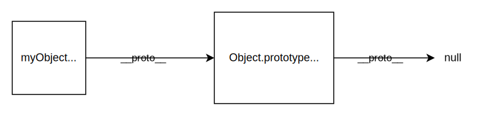
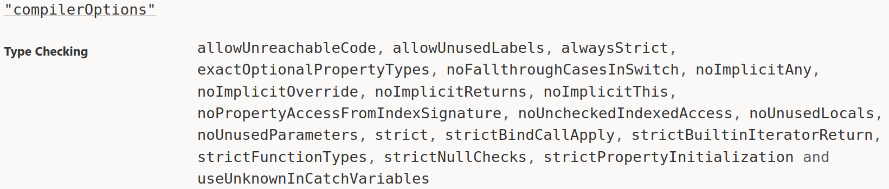

<style>
  .dark-shadow {
    background-color: #00000055;
    box-shadow: 0 0 15px 8px #00000055;
  }
</style>
<div class="dark-shadow" style="background-color: #00000055; padding-block: 0.3rem; margin-inline: -70px">

# Дырявое решето типов

Разбираемся с отношением подтипов в TypeScript

</div>
<br />

<div class="dark-shadow" style="position: absolute; bottom: 100px; left: 0; right: 0; font-style: italic; padding-block: 0.1rem">
<p style="font-size: 1.5rem; margin: 0"><b>Василий Алфертьев</b></p>
<p style="font-size: 1rem; margin: 0">Frontend-разработчик, "Открытые решения"</p>
</div>

<!--
Всех приветствую на моём докладе "Дырявое решето типов" или "Разбираемся с отношением подтипов в TypeScript". Почему именно такое название, станет понятно в ходе доклада.
-->

---
layout: default
---

# Приятно познакомиться

<style>
  .two-cols-grid {
    align-items: center;
  }
</style>
<div class="two-cols-grid">
  <div class="two-cols-grid"><div><b>Василий Алфертьев</b></div></div>
  <div>
    
  </div>
  <div>
    <p> <b>Telegram</b>: <a href="https://t.me/alfertev2012">@alfertev2012</a></p>
    <p> <b>GitHub</b>: <a href="https://github.com/alfertev2014">@alfertev2014</a></p>
  </div>
  <div>
    <div class="two-cols-grid">
      <div> React</div>
      <div> TypeScript</div>
    </div>
  </div>
</div>

<!--
Сперва, кто я такой. Я Василий Алфертьев, в настоящее время - frontend-разработчик в компании Открытые решения, пишу на React-е, активно использую TypeScript.
-->

---
layout: default
---

# Чем ещё владею

<style>
li {
  margin-block: 0;
}
</style>
<div class="two-cols-grid">

<div>

- 5+ лет в **С++**:
  - системное программирование
  - Linux
  - UI на Qt

</div>
<div>

- Увлекаюсь
  - **дизайном языков программирования**
  - best practices и архитектурой ПО
  - математической логикой

</div>
<div>

- ~6 лет в **Java**:
  - backend на Spring
  - базы данных
  - монолиты, микросервисы…

</div>
<div>

<ul>
<li><b v-mark.red>Фанат систем типов</b></li>
<li>Тянет разбираться в
  <ul>
  <li>компиляторах и оптимизациях</li>
  <li>"кишках" runtime разных языков</li>
  <li>IDE и инструментах</li>
  </ul>
</li>
</ul>
</div>
</div>

<!--
А когда-то много занимался системным программированием на C++, писал UI на Qt, прошёл через backend-разработку на Java... И параллельно увлекался вопросами дизайна языков программирования, математическими основами, которые за ними стоят... Фанат систем типов. Люблю поинтересоваться, как устроены компиляторы, IDE и другие инструменты.

И вот с этим опытом, после некоторого наблюдения за развитием веба и TypeScript-а, я таки пришёл во frontend-разработку, возлагая на TypeScript определённые надежды.
-->

---
layout: default
transition: my-transition
dragPos:
  tapl: 578,122,300,_
  typing_rules: 101,167,309,_
  typing_rules2: 80,385,392,_
  complex_types: 35,210,917,_
  mortal_combat: 257,250,482,_
  typescript_is_bad: 700,145,198,_
  bad_ts: 514,343,384,_
  prototype_chain: 89,314,552,_
  proxy: 652,94,291,_
  devid: 672,304,223,_
  tsgo: 307,117,653,_
  tsgo_link: 462,376,435,_
  nothing: 334,394,603,_
  nothing1: 77,244,369,20,-48
  nothing2: 78,244,372,20,46
---

# Вокруг TypeScript много интересного

<div v-click="[1, 2]">
  
  
  
</div>
<div v-click="[2, 3]">
  <div v-drag="'complex_types'" style="padding: 10px; --slidev-code-font-size: 16px;">
  
```ts
// Transform properties to getters
type Getters<Type> = {
  [Property in keyof Type as `get${Capitalize<string & Property>}`]: () => Type[Property]
};

// Remove the 'kind' property
type RemoveKindField<Type> = {
  [Property in keyof Type as Exclude<Property, "kind">]: Type[Property]
};
```

  </div>
</div>
<div v-click="[3, 4]">
  
</div>
<div v-click="[4, 5]">
  
  
  
</div>
<div v-click="[5, 6]">
  
  <div v-drag="'bad_ts'" style="text-align: right">
    <p><b>Why TypeScript is Bad</b></p>
    <p><a href="https://t.me/why_typescript_is_bad">https://t.me/why_typescript_is_bad</a></p>
  </div>
</div>
<div v-click="[6, 7]">
  
  <div v-drag="'tsgo_link'" style="text-align: right">
    <p><a href="https://github.com/microsoft/typescript-go">https://github.com/microsoft/typescript-go</a></p>
  </div>
</div>
<div v-click="7">
  <div v-drag="'nothing'" style="font-size: 2rem"><b>Этого в докладе не будет</b></div>
  <div v-drag="'nothing1'" style="background-color: rgb(200, 0, 0)"></div>
  <div v-drag="'nothing2'" style="background-color: rgb(200, 0, 0)"></div>
</div>

<v-clicks>

- Погружение в теорию типов
- Программирование на типах
- Сравнение статической типизации с динамической
- Метапрограммирование на прототипах и Proxy
- Разбор *всех* проблем TypeScript
- Миграция tsc на Go

</v-clicks>

<!--
Потому что в TypeScript много чего интересного, несмотря на кажущуюся простоту.

1. Это и мощная система типов, за которой стоят хитрые математические идеи. И в них тоже бывает полезно погрузиться. Здесь я сразу порекомендую книгу Бенжамина Пирса "Типы в языках программирования", где даётся хорошее введение в теорию.

2. И да! Система типов TypeScript достаточно мудрёная, что на типах можно даже программировать, использовать тайпчекер как интерпретатор, а также, строить сложные утилитные типы.

3. Вечный холивар, нужны ли типы вообще при существовании языков с динамической типизацией, на которых в короткие сроки можно писать рабочие приложения.

4. А также, вспомним, какую динамическую природу имеют объекты в JavaScript. В сочетании с механизмами прототипного наследования и прокси есть возможности творить очень хитрое "особое уличное" метапрограммирование. И тут тоже вопрос, как статической типизации сосуществовать со всей этой динамической магией.

5. Несмотря на мощную теорию и многообещающие возможности, TypeScript имеет много изъянов, о которых тоже стоит знать и иметь ввиду. Есть интересный канал в телеграмме Why TypeScript is Bad, где люди разбирают различные примеры, на которых TypeScript ломается или вызывает вопросы.

6. Также, про TypeScript есть много новостей. Например, вот недавний хайп про переписывание компилятора на Go.

7. Так вот, всего этого сегодня в докладе не будет.
-->

---
layout: default
hideInToc: true
---

# План доклада

1. Проблема надёжности типов
2. Ненадёжность системы типов TypeScript
3. Отношение подтипов в TypeScript
4. Проблемы подтипов в TypeScript на примерах
5. Заключение

<!--
Сегодня я хочу поговорить немного о другом, на более узкую тему, а именно, про некоторые проблемы системы типов TypeScript, которые больше всего мешают ему быть надёжным и строгим языком. Разберём, что такое отношение подтипов и какие с ним связаны проблемы, на примерах. И в конце подумаем, что с этим можно сделать.
-->
---
layout: section
---

<h1><span class="number">1. </span>Проблема надёжности типов</h1>

<!--
Тут можно было бы много рассуждать, в каких случаях полезна статическая типизациа, а какие преимущества есть у динамической.
-->
---
title: Проблема
layout: default
---

# Задача

- Задействовать возможности TypeScript для увеличения строгости **прикладного кода**, используя типы как **_спецификацию_**.

<br />

<v-click>

# Проблема

- Система типов TypeScript имеет **существенные недостатки**, не позволяющие обеспечить строгие гарантии.

</v-click>

<!--
Но сегодня в рамках доклада предположим, что статическая типизация нам нужна, что мы пишем прикладной код в определённом стиле - без динамической магии, в удобном для статического анализа виде - и хотим использовать типы по максимуму как спецификацию программы. А тайпчекер проверял бы соответствие программы её спецификациии, выраженной в типах.

1. А проблема в том, что TypeScript как он есть имеет существенные недостатки в самом фундаменте системы типов. Насколько эти недостатки существенны, мы и поговорим.
-->

---
layout: default
class: text-center
style: "background-color: black; color: white"
---

<h1 style="color: red">DISCLAIMER</h1>

<br />

Спикер не призывает к обязательному использованию TypeScript или других способов статической типизации для JavaScript.

Спикер понимает, что можно писать надёжно и продуктивно и на JavaScript без типов.

Спикер не ставит целью показать причины, по которым стоит отказаться от TypeScript.

<!--
Должен сказать, что я хоть и сторонник статической типизации, но не считаю, что надо лепить TypeScript везде, где только можно, любой ценой и не задумываясь.

И, конечно же, я понимаю, что на JavaScript можно и без типов писать надёжно и продуктивно, придерживаясь особых практик. Но это уже совсем другой стиль кода.

Также, я хоть и собираюсь сейчас в докладе ругать TypeScript за его недостатки, я не призываю отказываться от него, давать кому-то лишний повод сказать, что "типы не нужны".

-->
---
layout: section
---

<h1><span class="number">2. </span>Ненадёжность системы типов TypeScript</h1>

---
layout: default
---

# TypeScript ругают за

<div style="display: flex; flex-flow: row nowrap; gap: 30px">
<div style="flex-grow: 1">

- Ненадёжная система типов
- Слабо типизированная стандартная библиотека JavaScript
- Неактуальные “.d.ts”-файлы для библиотек из NPM
- Высокий порог входа (“трёх-этажные типы”)
- Борьба с ошибками компиляции

</div>
<div style="width: 40%">
  
</div>
</div>

<!--
А за что обычно ругают TypeScript?

Всем должно быть уже известно, что система типов TypeScript не надёжна, и бесшовное взаимодействие с JavaScript вызывает ещё больше проблем. 

И надо сказать, что TypeScript не самый простой язык. Даже некоторые повседневные с точки зрения JavaScript приёмы могут потребовать написания сложных трёх-этажных типов. И если в них запутаться, это всё может вылиться в непродуктивную борьбу с компилятором по устранению ошибок, при которой так и хочется влепить any или принудительно привести тип через as.

Кстати, обещаю, в все примеры в этом докладе будут простые, даже generic-ов не будет.
-->

---
layout: default
---

# Ненадёжность "by design"

[https://github.com/Microsoft/TypeScript/wiki/TypeScript-Design-Goals]

**Non-goals:**

- Apply a **sound**`*` or "**provably correct**" type system. Instead, strike a balance between correctness and productivity.

`*` Система типов является надёжной (“**sound**”), если статически выведенные типы выражений **_гарантированно_** соответствуют значениям в runtime.

<!--
Надёжность (по английски термин звучит как soundness) - это свойство системы типов, при котором выведенные типы гарантированно соответствуют тем значениям, которые будут получены в результате исполнения программы.

В такой строгой формулировке надёжность не заявляется как цель при разработке TypeScript. Вместо этого TypeScript стремится быть всего лишь инструментом для повышения продуктивности, что бы это ни значило. Насколько это разумное решение, мне сложно сказать. Вероятно, в противном случае TypeScript не получил бы такого распространения.
-->
---
layout: default
---

<style scoped>
  p {
    background-color: #ffffff;
    box-shadow: 0 0 8px 5px #fff;
  }
</style>

# И как с этим жить?


<br />
<div style="text-align: center; font-size: 1.7rem">
<v-clicks>

Мы **_хотим_**, чтобы типы в коде были верными

*Ответственность ложится на разработчика*

Type checker - просто инструмент

Для гарантий нужны **_best practices_** и **_соглашения_**

</v-clicks>
</div>

<!--
Ну, и ладно. Что теперь нам делать с этим? Ведь несмотря на ненадёжность языка, мы хотим, чтобы те типы, которые мы пишем в коде, действительно соответствовали тем значениям, которые получаются при его исполнении. Иначе, зачем мы тогда их пишем?

Просто ответственность за обеспечение корректности программ ложится на самих разработчиков.

А тайпчекер нам это гарантировать не сможет, это всего лишь инструмент, который как-то может нам в этом помочь.

И для обеспечения корректности программ придётся дополнительно придерживаться дисциплины соглашений и best practices.
-->

---
layout: default
dragPos:
  first_time: 262,29,404,_
  cpp: 442,272,54,_
---


<div v-drag="'cpp'" style="background-color: white;text-align: center">
<b>C++</b>
</div>

<!--
Знакомо, да? Где-то вы такое уже, наверняка, слышали.

Можно успокоить себя тем, что практически ни один из популярных языков программирования не обладает надёжной системой типов, и мы как-то с этим живём.

Но, как говорится, языки программирования делятся на две группы: те, которые все ругают, и те, которые никто не использует.
-->

---
layout: default
---

# Ненадёжная система типов

<style>
  .slidev-vclick-hidden {
    display: none;
  }
  li.slidev-vclick-hidden {
    display: list-item;
    opacity: 0.5 !important;
  }
  li .slidev-vclick-target {
    font-weight: normal
  }
</style>
<ul>
<li v-click="1">Намеренное нарушение надёжности
  <ul v-click="[1, 2]">
  <li><code>any</code> - неявное приведение к чему угодно</li>
  <li><code>as</code> - потенциально ошибочные приведения типов</li>
  <li><code>is</code> - потенциально ошибочные type predicates</li>
  <li><code>declare</code> - по сути то же самое, что и <code>as</code></li>
  </ul>
</li>
<li v-click="2">Отключаемая надёжность (флаги "strict")</li>
  
<li v-click="3">Взаимодействие с JavaScript-кодом
  <ul v-click="[3, 4]">
  <li>В JavaScript по-умолчанию всё <code>any</code></li>
  <li>Слабо типизированная стандартная библиотека</li>
  <li>“Магия” изменяемых прототипов, <code>Object.defineProperty</code>, <code>Object.freeze</code>, <code>Proxy</code>, переопределение <code>instanceof</code>, оператор <code>delete</code>…</li>
 </ul>
</li>
<li v-click="4">Врождённые проблемы в дизайне системы типов</li>
</ul>

<!--
Говоря про ненадёжность системы типов, стоит понимать, что ненадёжность бывает разной: иногда более опасной, а иногда вполне безобидной. Я поделил возможные причины ненадёжности на несколько групп.

1. Во-первых, это случаи намеренного нарушения надёжности, когда программист сам в коде пишет, что хочет нарушить обычный ход алгоритма проверки типов.
2. Во-вторых, вспомним, что у компилятора TypeScript в tsconfig есть много флагов, влияющих на строгость языка, которые тоже можно отключить. И вообще, для каждой комбинации таких флагов мы как бы получаем новую вариацию языка со своей семантикой.
3. Третья группа причин ненадёжности, это, конечно же, JavaScript по соседству. Бесшовное взаимодействие с JavaScript настолько бесшовное, что отсутствуют какие-либо проверки на границе двух языков. И TypeScript по-умолчанию воспринимает JavaScript-код как проверенный программистом. При этом сама стандартная библиотека местами типизирована довольно жёстко и неудобно.
4. Первые три группы причин ненадёжности предполагают, что программист может относительно легко проследить за ними в коде, держать под контролем, чтобы не допускать ошибок. Но есть такие проблемы системы типов, которые могут присутствовать в коде незаметно, и связаны с врождёнными проблемами в дизайне языка.
-->

---
layout: image
image: ./images/backward_compatibility.jpg
backgroundSize: contain
dragPos:
  good: 711,74,166,187
  back: 88,240,176,214
  backward_compatibility: 117,47,744,_
  ts: 372,105,126,_
---

<div v-drag="'good'" style="text-align: right; font-size: 1.7rem">
  <b>Сделать всё по хорошему</b>
</div>
<div v-drag="'back'" style="font-size: 1.7rem">
  <b>Обратная совмести-мость</b>
</div>


<!--
Многие из этих проблем давно известны и обсуждаются на GutHub-е, но их не исправляют по причине обратной совместимости. Видимо, сейчас если что-то переделывать по уму, то это будет существенной переработкой языка, и сломается половина NPM.
-->

---
layout: section
---

<h1><span class="number">3. </span>Отношение подтипов в TypeScript</h1>

---
layout: default
---

# Возможности системы типов TypeScript

<ul>
<li><b>Структурная</b> типизация</li>
<li><span v-mark.circle.red="1">Отношение <b>подтипов</b></span></li>
<li><b>Рекурсивные</b> типы</li>
<li><b>Union</b> и <b>Intersection</b> типы</li>
<li><b>Unit</b> типы (или литеральные типы)</li>
<li><b>Generics</b> (первого порядка) с <b>ограничениями</b> сверху на параметры и <b>вариантностью</b></li>
<li><b>Условные</b> типы</li>
<li><b>Flow typing</b> и <b>type predicates</b></li>
</ul>

<!--
Система типов TypeScript богата на различные возможности, дающие языку гибкость. И проблемы можно поискать в них во всех. Но сегодя сосредоточимся только на отношении подтипов.
-->

---
layout: section
---

# Отношение подтипов

---
layout: section
---

<h1><b>
<span v-click="1">B</span>&nbsp;
<span>&lt;:</span>&nbsp;
<span v-click="1">A</span>
</b></h1>

<!--
В математической литературе отношение подтипов обозначается вот таким соочетанием символов.

1. Оно означает, что тип B является подтипом типа A, а тип A является надтипом типа B.
-->
---
layout: default
---


<!--
И если вспомнить, что типы в TypeScript представляют собой множества допустимых значений, то отношение подтипов соответствует одношению вложения множеств.
-->

---
layout: default
dragPos:
  subtyping_set: 412,112,337,260
---

# Пересечение и объединение типов

<br />

- `A <: A | B`
- `B <: A | B`

<br />

- `A & B <: A`
- `A & B <: B`


<!--
Union и Intersection-типы соответствуют объединению и пересечению множеств. Поэтому правила отношения подтипов для них должны быть очевидны.
-->

---
layout: default
---

# Подтипы объектов

<div class="two-cols-grid" style="align-items: center">
<div>

```ts {all|2,6|7|all}
type A = {
  foo: string
}

type B = {
  foo: string
  bar: number
}
```

</div>
<div class="text-center" style="font-size: 2rem">
<b v-click="3">B &lt;: A</b>
</div>
</div>

<!--
Для объектных типов с точки зрения типовой безопасности в целевой среде JavaScript логично, что если где-то ожидается объект с определёнными properties, например, типа А, то туда безопасно можно передать любой объект с такими же properties + любыми другими дополнительными, например, типа B. В таких случаях типы B и A тоже находятся в отношении подтипов.
-->

---
layout: default
---

# Проверка отношения подтипов

<div class="two-cols-grid">
<div>

```ts {all|5,10}{at:1}
const b: B = {
  foo: "the Answer",
  bar: 42
}
const a: A = b

let m: A = {
  foo: "the Question"
}
m = b
```

</div>
<div>

```ts {all|6,10}{at:1}
type C = {
  prop: A
}

const c: C = { prop: a }
c.prop = b

const f = (arg: A) => { /* do something */ }

f(b);
```

</div>
</div>

<p v-click="2" class="text-center" style="font-size: 2rem">
  <b>Актуальный тип &lt;: Ожидаемый тип</b>
</p>

<!--
Проверка отношения подтипов происходит в моменты проверки совместимости типов при инициализации и присваиваниях для переменных и properties, а также, при передаче аргумента в функцию.

1. При этом важно, чтобы так называемый актуальный тип передеданного значения был подтипом ожидаемого типа. В этом случае обеспечивается типовая безопасность, и переданный объект актуального типа не приведёт к ошибкам.
-->

---
layout: default
---

# Подтипы объектов

<div class="two-cols-grid" style="align-items: center">
<div>

```ts {all|2,6|all}
type A = {
  foo: string | number
}

type B = {
  foo: string
}
```

</div>
<div class="text-center" style="font-size: 2rem">
<b><span v-click="2">B &lt;: A </span><span v-click>?</span></b>
</div>
</div>

<!--
А что насчёт типов значений properties в объектах? Они не обязаны совпадать, но тоже должны находиться в отношении подтипов для одинаковых ключей.

1. Как в этом примере, где объединение string и number является надтипом типа string. Поэтому и тип A является надтипом типа B.

Никому ещё не захотелось прервать меня здесь и сказать, что всё неправильно, я не прав, и всё, на самом деле, не так?

2. Действительно, есть нюанс: А является ли на самом деле тип B подтипом A в таких случаях? Именно про это мы чуть позже и разберём.

-->

---
layout: section
---

# Решётка типов

<!--
Но сначала посмотрим, во что вырисовывается отношение подтипов в целом.
-->

---
layout: default
---


<!--
Если начать строить надтипы объектного типа, а потом и их надтипы - вплоть до пустого объектного типа, то получится вот такая визуализация.
-->

---
layout: default
---


<!--
Если продолжить и представить все возможные типы TypeScript и как они связаны отношением подтипов между собой, то мы и получим так называемую решётку типов. На вершине будет тип unknown, в самом низу будет тип never. Где-то сбоку стоит any, где-то сбоку стоит void... Решёткой это называется, потому что это термин из математики. И я попытаюсь сейчас его объяснить.

Ну, вы уже догадываетесь, какой будет следующий мем?
-->

---
layout: image
image: /images/pepe.png
---

---
layout: image
image: /images/set.svg
---

<!--
Итак, представим, у нас есть множество элементов
-->

---
layout: image
image: /images/suborder.svg
---

<!--
На котором задано отношение частичного порядка. Например, вот так в виде направленного ациклического графа.
-->

---
layout: image
image: /images/sup_inf.svg
---

<!--
И не какое-нибудь, а такое, что для любой пары элементов можно найти "точную верхнюю грань" - наименьший элемент, который больше обоих, и "точную нижнюю грань" - наибольший элемент, который меньше обоих. А также, существует единственный "нулевой" элемент, который меньше всех остальных, и единственный "единичный" элемент, который больше всех остальных. Вот такая алгебраическая система и называется решёткой.
-->

---
layout: image
image: /images/union_intersection.svg
---

<!--
И в случае типов отношением порядка выступает отношение подтипов. Точная верхняя грань - это union-типы, а точная нижняя грань - intersection-типы. never - это нулевой элемент, а unknown - единичный.
-->
---
layout: default
---

# Type compatibility

[https://www.typescriptlang.org/docs/handbook/type-compatibility.html]

В TypeScript различаются понятия **subtype**- и **assignment**-совместимости типов.

Например:

- Поведение `any` при присваивании
- Проверка лишних (excess) properties при инициализации
- Проверка `readonly`-полей при присваивании

<!--
Если обратимся к документации по TypeScript, то там есть целая отдельная страница, посвещённая проверке типов на совместимость. И там чётко сказано, что настоящее строгое отношение подтипов не используется. И вместо этого применяется assignment-совместимость типов, которая отличается от настоящего отношения подтипов. Например, в логике работы с типом any, с лишними properties в объектах, с модификатором readonly. Мы далее рассмотрим эти случаи.
-->

---
layout: section
---

<h1><span class="number">4. </span>Проблемы подтипов в TypeScript на примерах</h1>

---
layout: default
dragPos:
  playground_options: 573,121,222,_
---

# Поиграемся в TypeScript Playground

[https://www.typescriptlang.org/play/]

TypeScript **v5.9.2**


<!--
Что ж, давайте перейдём к примерам кода. Пробовать будем на свежей версии TypeScript, конфиг оставим рекомендуемый по-умолчанию, в котором, конечно же, включены флаги strict-режима.
-->

---
layout: default
---

# Чем плох тип any?

<div class="two-cols-grid">

<div>

При записи - как `unknown`

```ts {all|3}{at:1}
const b: number = 42

const a: any = b
```

</div>
<div>

При чтении - как `never` `*`

```ts {all|3}{at:1}
const a: any = 42

const b: string = a

// const c: never = a
```

`*` если ожидаемый тип не `never`

</div>
</div>

<!--
На any долго останавливаться не будем. Все должны уже знать, чем опасен этот тип. При записи в него он ведёт себя, как unknown, а при чтении из него ведёт себя как never (кроме случая, когда ожидаемый тип never). Это, наверное, самая заметная дырень в решётке типов TypeScript.
-->

---
layout: default
---

<div style=" --slidev-code-font-size: 14px;">

```ts twoslash
const a1: {} = 42
const a2: {} = "the Answer"
const a3: {} = true
const a4: {} = false
const a5: {} = {}
const a6: {} = []
const a7: {} = () => {}

const a8: {} = null
const a9: {} = undefined
```

</div>

<div v-click class="reference">

**no-empty-object-type**

[https://typescript-eslint.io/rules/no-empty-object-type/]

</div>

<!--
Несколько забавных фактов о том, как работает структурная типизация. В JavaScript практически всё считается объектом, поэтому пустой объектный тип является надтипом любых значений, кроме null и undefined.

1. Это легко может приводить к путанице, поэтому в typescript-eslint есть правило no-empty-object-type.
-->

---
layout: default
---

<div style=" --slidev-code-font-size: 14px;">

```ts twoslash
const a1: object = 42
const a2: object = "the Answer"
const a3: object = true
const a4: object = false
const a5: object = {}
const a6: object = []
const a7: object = () => {}

const a8: object = null
const a9: object = undefined
```

</div>

<!--
Стоит его заменить на тип object, и он уже не будет в себя принимать значения, у которых typeof не равен object или function.
-->

---
layout: default
dragPos:
  tak_mozno: 488,245,340,_
---

```ts {all|3,9,13}
const a1: {
  toLocaleString: () => string;
} = 42;

const a2: {
  codePointAt(pos: number): number | undefined;
  charAt: (pos: never) => unknown;
  // ...
} = "the Answer";

const a3: {
  valueOf: () => boolean;
} = true;
```


<!--
Но больше всего забавляет, что так как значения примитивных типов рассматриваются как объекты со своими properties и методами, для них можно построить надтипы в виде непустых объектных типов, содержащих те же методы. Можно даже точную сигнатуру не указывать. Это работает! И это не противоречит типовой безопасности. Ведь если вам понадобится узнать, действительно ли это number, string или boolean, вы будете вынужнены это сделать динамической проверкой через typeof.
-->

---
layout: section
---

# Excess properties

<!--
Лишние или excess properties
-->
---
layout: default
---

```ts twoslash
type A = {
  foo: string
}

const a: A = { foo: "the Answer", bar: 42 }

const f = (arg: A) => { /* do something */ }

f({ foo: "the Answer", bar: 42 })
```

<!--
Это тот случай, когда TypeScript занимается не проверкой типов, а берёт на себя роль линтера. Если мы посмотрим на объектный литерал, то его выведенный тип вроде бы является подтипом ожидаемого типа. Но разработчики TypeScript решили, что лишние properties легко могут оказаться опечатками, поэтому при инициализации лучше считать их за ошибки, хотя они и не нарушают типовую безопасность.
-->

---
layout: default
---

````md magic-move
```ts
type A = {
  foo: string
}

const a: A = { foo: "the Answer", bar: 42 }

const f = (arg: A) => { /* do something */ }

f({ foo: "the Answer", bar: 42 })
```
```ts {5}
type A = {
  foo: string
}

const b = { foo: "the Answer", bar: 42 }
const a: A = b

const f = (arg: A) => { /* do something */ }

f(b)
```
````

<div v-click class="reference">

**Excess Property Checks**

[https://www.typescriptlang.org/docs/handbook/2/objects.html#excess-property-checks]

</div>

<!--
1. Стоит нам вынести объектное выражение в отдельную константу - и проверки лишних properties уже не происходит.

2. Стоит помнить об этой особенности. Иногда это полезно, когда мы намеренно хотим передать дополнительные properties.
-->

---
layout: default
---

# Что есть объектный тип?

````md magic-move
```ts
type A = {
  foo: string
  bar: boolean
  baz: number
}
```
```ts {5}
type A = {
  foo: string
  bar: boolean
  baz: number
  [key: string | number | symbol]: unknown
}
```
```ts {6}
type A = {
  foo: string
  bar: boolean
  baz: number
  [key: string | number | symbol]: unknown
  (...args: unknown[]): unknown
}
```
```ts {7}
type A = {
  foo: string
  bar: boolean
  baz: number
  [key: string | number | symbol]: unknown
  (...args: unknown[]): unknown
  new (...args: unknown[]): unknown
}
```
````

<!--
А вообще, проверка лишних properties поднимает такой вопрос. Что в TypeScript понимается под объектным типом? Ведь чаще всего мы пользуемся объектными типами, когда точно знаем, что в объекте лежит ровно вот это, и ничего больше нет. Однако, вот такая запись лишь означает, что в объекте обязательно есть properties a, b, c со значениями указанных типов, и никак не ограничивает, чтобы в объекте больше ничего не было.

1. То есть, условно, в этом объекте могут быть любые другие неизвестные properties любых типов.

2. А возможно, этот объект - функция, и его можно вызвать как функицю.

3. А если это функция, то, может быть, даже можно вызвать как конструктор

В TypeScript принята открытая модель объектных типов. И нет способов сказать, чтобы для некоторого объектного типа другие типы с дополнительными properties считались с ним несовместимыми.
-->

---
layout: default
---

# Exact Types

[https://github.com/microsoft/TypeScript/issues/12936]


<!--
Про это можно почитать обсуждение на GitHub в issue про точные типы, почему TypeScript их решили не делать. Хотя может показаться, что проверка лишних properties в объектных выражениях - это оно и есть. Но нет, это частный узкий случай.
-->

---
layout: default
---

````md amgic-move
```ts {all|1-3|5,6|8|10|12}
type A = { foo: string }
type B = { foo: string; bar: number }
type C = { foo: string; bar: boolean }

const b: B = { foo: "the Answer",   bar: 42 }
const c: C = { foo: "the Question", bar: true }

const a: A = c

const d: B = { ...b, ...a }

console.log(d.bar.toFixed())
```
```ts {1}
type A = { foo: string; [key: string | number | symbol]: unknown }
type B = { foo: string; bar: number }
type C = { foo: string; bar: boolean }

const b: B = { foo: "the Answer",   bar: 42 }
const c: C = { foo: "the Question", bar: true }

const a: A = c

const d: B = { ...b, ...a }

console.log(d.bar.toFixed())
```
````

<div v-click="5" class="slidev-code error-output">
TypeError: d.bar.toFixed is not a function
</div>

<!--
Но отсутствием точных типов связана проблема. Вот типы B и C, которые с точки зрения TypeScript являются подтипами типа A. Они оба расширяют тип A дополнительным property с одинаковым ключом bar, но с несовместимыми типами значений number и boolean.
В данном примере мы создаём объекты типов B и C

1. Берём ссылку на объект c, рассматривая его как объект типа A.

2. И хотим собрать из объектов b и c новый объект, используя spread-оператор. TypeScript считает, что результирующий тип будет B, не подозревая, что в константе a лежит объект типа C, в котором есть property bar типа boolean, которое затрёт property bar, из объекта b.

3. И бац! - Мы получаем ошибку в рантайме, потому что попытались использовать property bar как число, а там лежит boolean.

Ещё раз: Для spead-оператора TypeScript думает, что тип объекта точный, и не учитывает, что в объекте могут быть какие угодно другие properties, которые могут перетереть те properties, которые уже добавлены в результирующий объект. Хотя в остальных случаях TypeScript считает объектные типы открытыми.
-->

---
layout: image
image: /images/cigarete.png
backgroundSize: contain
---

<!--
И я как вспомню, сколько раз я на практике видел такие приёмы, когда мержат объекты с помощью spead-оператора, например, при прокидывании пропсов в реакте или формировании какого-то конфига из миксинов.

Вообще говоря, даже с точки зрения JavaScript-а это делать небесопасно, и лучше всегда стараться явно перечислять properties, которые вы хотите достать из объекта, и не злоупотреблять spread-оператором.
-->

---
layout: default
---

# А ещё...

<div>

TypeScript не различает и не учитывает:

</div>

- **own** properties
- **enumerable** properties
- **configurable** properties (можно ли удалять через `delete`)
- `value`, `writable`, `get`, `set`
- `Object.freeze`
- `Proxy`

<!--
А ещё, говоря про properties объектов, TypeScript не учитывает, являются ли они own, то есть взяты ли из самого объекта или из прототипа, перечислимы ли они, можно ли их удалять через delete, просто не учитывает десктипторы, например, не различает, является ли property парой getter и setter.

Также, TypeScript не отслеживает, был ли заморожен объект через Object.freeze, или, может, это вообще Proxy, обрабатывающее обращение к properties особым образом.
-->

---
layout: section
---

# Подтипы и вариантность

<!--
Вернёмся к вопросу, в каких случаях стоит считать объектные типы подтипами.
-->
---
layout: default
---

```ts {all|1,2|4,5|7|9}
type A = { prop: string | boolean }
type B = { prop: string }

const b: B = { prop: "foo" }
const a: A = b

a.prop = true

console.log("b.prop", b.prop.toUpperCase())
```

<div v-click="4" class="slidev-code error-output">
TypeError: b.prop.toUpperCase is not a function
</div>

<!--
Вот есть типы A и B, отличающиеся только типом значения property. TypeScript считает, что B является подтипом A, и можно создать объект типа B со строкой в property и присвоить его в константу a. И вот мы через a изменяем это на boolean. Продолжаем работать с этим объектом через ссылку b, которая всё ещё думает, что это объект типа B, пробуем работать с property как со строкой, а там лежит boolean. Получаем ошибку в runtime.
-->
---
layout: default
class: text-center
---

<div style="font-size: 1.5rem">
<br />
<br />
<br />

**Если `B <: A`, то `{ prop: B } <: { prop: A }` ?**

</div>

<!--
В общем виде этот вопрос можно сформулировать так. Если B это подтип A, то является ли объект с property типа B подтипом объекта с тем же property типа A? Это свойство назвается ковариантность.
-->
---
layout: default
class: text-center
---

<br />
<div style="font-size: 1.5rem">

Ковариантность:

`B <: A`  ===>  `C<B> <: C<A>`

<br />

Контравариантность:

`B :> A`  ===>  `C<B> <: C<A>`

</div>

<!--
А бывает ещё контравариантность, когда наоборот. И контравариантность свойственна для функциональных типов и их параметров.
-->
---
layout: default
transition: slide-up
---

```ts {all|2,3,7,8}
type FA = {
  getProp: () => string | boolean
  setProp: (arg: string | boolean) => string | boolean
}

type FB = {
  getProp: () => string
  setProp: (arg: string) => string
}
```

<!--
Давайте попробуем заменить property на пару getter и setter для тех же самых типов значений proeprty.
-->
---
layout: default
transition: none
---

```ts twoslash
type FA = {
  getProp: () => string | boolean
  setProp: (arg: string | boolean) => string | boolean
}

type FB = {
  getProp: () => string
  setProp: (arg: string) => string
}
// ---cut---
// ...
const fb: FB = { getProp: () => "the Question", setProp: (arg) => "the Answer" }
const fa: FA = fb
fa.setProp(true)
```

<!--
В этом случае TypeScript нас поймает за руку и уже не позволит объект типа FB присвоить объекту типа FA. Типы оказываются несовместимыми, причём, потому, что несовместимы оказываются типы аргументов сеттеров. Getter ведёт себя ковариантно - и всё нормально, а setter - требует контравариантности.

И вот тут у меня возникает вопрос, почему бы все модифицируемые properties не рассматривать аналогичным образом? Почему TypeScript слепо применяет ковариантность, когда она тут неуместна?

Опять же, причина тому, что в мире уже много написано кода, который предполагает ковариантность properties объектов и вроде бы с этим живёт.
-->
---
layout: section
---

# strictFunctionTypes


---
layout: default
---

# strictFunctionTypes

[https://www.typescriptlang.org/tsconfig/#strictFunctionTypes]

<div class="two-cols-grid" style="grid-template-columns: 2fr 1fr">

<div>

Включает **контравариантное** поведение функциональных типов **по аргументам**.

<div class="text-center">

Если `T2 :> T1` и `R2 <: R1`,

то `(a: T2) => R2 <: (a: T1) => R1`.

</div>

</div>
<div>


</div>
</div>

<!--
Кстати, контравариантное поведение функциональных типов было не всегда. Оно появилось лишь с флагом strictFunctionTypes, который сейчас по-умолчанию включен в группу флагов strict. А до этого, по сути, типы аргументов функций и не проверялись вообще, применялось так называемое бивариантное поведение. Я боюсь представить, что тогда было.
-->

---
layout: default
---

# strictFunctionTypes и методы

[https://www.typescriptlang.org/tsconfig/#strictFunctionTypes]

During development of this feature, *we discovered a large number of inherently unsafe class hierarchies*, including some in the DOM. Because of this, the setting only applies to functions written in function syntax, **not to those in method syntax**.

<v-click>

*Перевод*:

В ходе разработки этой фичи, *мы обнаружили большое количество небезопасных по своей природе иерархий классов*, включая некоторые в DOM API. Из-за этого данная настройка применяется только для функций, написанных в функциональном синтаксисе, **но не в синтаксисе методов**.

</v-click>

<!--
Но почитаем внимательнее документацию, и там сказано, что strictFunctionTypes работает только для функциональных типов, но не для методов. Потому что когда его включали в язык, обнаружили много деклараций типов, полагающихся на небезопасное поведение
-->

---
layout: default
---

```ts {all|2|11|6,13}
type Methodish = {
  func(x: string | number): void
}

function fn(x: string) {
  console.log("Hello, " + x.toLowerCase())
}
 
// Ultimately an unsafe assignment, but not detected
const m: Methodish = {
  func: fn,
}
m.func(10)
```

<div v-click="3" class="slidev-code error-output">
x.toLowerCase is not a function
</div>

---
layout: default
---

```ts {monaco-diff} { editorOptions: { renderSideBySide: false, fontSize: '16px', maxHeight: '100%', readonly: true } }
type Methodish = {
  func(x: string | number): void
}

function fn(x: string) {
  console.log("Hello, " + x.toLowerCase())
}

const m: Methodish = {
  func: fn,
}
m.func(10)
~~~
type Methodish = {
  func: (x: string | number) => void
}

function fn(x: string) {
  console.log("Hello, " + x.toLowerCase())
}

const m: Methodish = {
  func: fn,
}
m.func(10)
```

---
layout: default
---

```ts twoslash
type Methodish = {
  func: (x: string | number) => void
}

function fn(x: string) {
  console.log("Hello, " + x.toLowerCase())
}

const m: Methodish = {
  func: fn,
}
m.func(10)
```

---
layout: default
---

# method-signature-style

[https://typescript-eslint.io/rules/method-signature-style/]

```ts {all|3}
type Options = ['method' | 'property'];

const defaultOptions: Options = ['property'];
```

<br />

<v-click at="1">

- `"property"`: Enforce using property signature for functions. Use this to enforce maximum correctness together with TypeScript's strict mode.

</v-click>

---
layout: section
---

# readonly

---
layout: default
dragPos:
  readonly: 68,321,408,_
  captain: 459,54,448,_
---

```ts {2|all|9}{at:2}
type A = { prop: string | boolean }
type B = { readonly prop: string }

const b: B = { prop: "foo" }
const a: A = b

a.prop = true

console.log("b.prop", b.prop.toUpperCase())
```

<div v-click="3" class="slidev-code error-output">
TypeError: b.prop.toUpperCase is not a function
</div>

<div v-drag="'readonly'" v-click.hide="1" style="font-size: 1.5rem">

Да просто влепи **readonly**!

</div>


---
layout: default
transition: slide-up
---

# Readonly Properties

[https://www.typescriptlang.org/docs/handbook/2/objects.html#readonly-properties]

```ts {all|7,8}
interface Person {
  name: string;
  age: number;
}

interface ReadonlyPerson {
  readonly name: string;
  readonly age: number;
}
```

---
layout: default
---

```ts {all|7|10}
let writablePerson: Person = {
  name: "Person McPersonface",
  age: 42,
};

// works
let readonlyPerson: ReadonlyPerson = writablePerson;

console.log(readonlyPerson.age); // prints '42'
writablePerson.age++;
console.log(readonlyPerson.age); // prints '43'
```

---
layout: default
transition: none
---

```ts
// also works
writablePerson = readonlyPerson;
```

<v-click>

<div class="reference">

**Readonly Properties**

[https://www.typescriptlang.org/docs/handbook/2/objects.html#readonly-properties]

</div>

TypeScript doesn’t factor in whether properties on two types are `readonly` when checking whether those types are compatible, so `readonly` properties **can also change via aliasing**.

</v-click>

<v-click>

*Перевод*:

TypeScript не учитывает, есть ли у properties двух типов модификатор `readonly`, когда проверяет эти типы на совместимость, так что `readonly` properties **могут быть изменены через другие ссылки на объект**.

</v-click>

---
layout: default
---

# "readonly modifiers are a joke"

- [https://github.com/Microsoft/TypeScript/issues/13002]


- [https://github.com/Microsoft/TypeScript/issues/13347]


---
layout: section
---

# Совмещаем несовместимое

---
layout: default
---

# Совместимость функциональных типов

<br />
<div class="two-cols-grid" style="grid-template-columns: 1fr 3fr; align-items: center">
<div class="text-center" style="font-size: 2rem">
<p><b>&lt;:</b></p>
</div>
<div>

```ts {all|4-7}
(a: string, b: boolean, c: number) => unknown
(a: string, b: boolean) => unknown
(a: string) => unknown
() => unknown
(a?: string) => unknown
(a?: string, b?: boolean) => unknown
(a?: string, b?: boolean, c?: number) => unknown
```

</div>
</div>

<v-drag-arrow pos="225,344,0,-177"/>

<v-drag-arrow v-click="1" pos="271,249,-1,95"/>

---
layout: default
---

```ts {all|1|3|5|1,7}
const a                        = (x?: number) => x?.toFixed();

const b: () => void            = a;

const c: (s?: string) => void  = b;

c("");
```

<div v-click="4" class="slidev-code error-output">
x.toFixed is not a function
</div>

---
layout: default
---

```ts {all|1-3|5-7|9}
type A = { foo: string }
type B = { foo: string, bar?: boolean }
type C = { foo: string, bar?: number }

const b: B = { foo: "the Answer", bar: false }
const a: A = b
const c: C = a

console.log("c.bar", c.bar?.toFixed())
```

<div v-click="3" class="slidev-code error-output">
_a.toFixed is not a function
</div>

---
layout: default
---


---
layout: default
---

# Pain points

- Ковариантность для изменяемых properties
- Отсутствие точных типов и `...`-оператор
- `readonly` properties не учитываются при проверке совместимости типов
- Опциональные аргументы и properties приводят к некорректному приведению типов

---
layout: section
---

<h1><span class="number">5. </span>Заключение</h1>

---
layout: default
---

# Выводы

<v-clicks>

- Иметь правильные типы в коде - must have
- Совместимость типов в TypeScript !== отношение подтипов
- Компилируется без ошибок !== не упадёт в runtime
- Best practices, соглашения, самодисциплина
- Придётся писать тесты
- RTFM! - Изучайте свой основной язык, на котором пишете

</v-clicks>

---
layout: default
---

# Спасибо за внимание!

<div class="two-cols-grid">
  <div>
    <span style="display: inline-block;padding: 0.8rem; border-width: 6px; border-color: #2d79c7">
      
    </span>
    <p><i>Полезные ссылки и <br />матетиалы к докладу</i></p>
  </div>
  <div>
    <div class="two-cols-grid" style="align-items: center">
      
      <p><b>Василий Алфертьев</b></p>
    </div>
    <br />
    <p> <b>Telegram</b>: <a href="https://t.me/alfertev2012">@alfertev2012</a></p>
    <p> <b>GitHub</b>: <a href="https://github.com/alfertev2014">@alfertev2014</a></p>
  </div>
</div>
