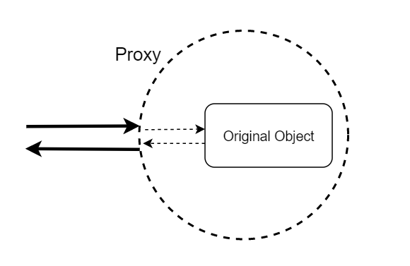

# Дырявое решето типов

Разбираемся с отношением подтипов в TypeScript

<!--
Всех приветствую на моём докладе "Дырявое решето типов" или "Разбираемся с отношением подтипов в TypeScript". Почему именно такое название, станет понятно в ходе доклада.
-->

---
level: 2
hideInToc: true
---

# Приятно познакомиться

- Василий Алфертьев
- Frontend разработчик (React + TypeScript)
- Компания: Открытые решения
- Telegram: @alfertev2012
- GitHub: alfertev2014

<!--
Сперва, кто я такой. Я Василий Алфертьев, в настоящее время работаю frontend-разработчиком в компании Открытые решения, пишу на React-е, активно использую TypeScript. Делаю UI различных одностраничных приложений.
-->

---
layout: two-cols-header
level: 2
hideInToc: true
---

# Чем ещё владею

::left::

- 5+ лет в **С++**:
  - системное программирование в Linux
  - UI на Qt
- ~6 лет в **Java**:
  - backend на Spring
  - базы данных
  - монолиты, микросервисы…

::right::

- Увлекаюсь
  - дизайном языков программирования
  - best practices и архитектурой ПО
  - математической логикой
- **Фанат систем типов**
- Тянет разбираться в
  - компиляторах и оптимизациях
  - "кишках" runtime разных языков
  - IDE и инструментах
  - LISP, Prolog, OCaml, Haskell, Scala…

<!--
Когда-то много занимался системным программированием на C++, писал UI на Qt, прошёл через backend-разработку на Java... И параллельно увлекался изучением вопросов дизайна языков программирования, математическими основами, которые за ними стоят... Фанат систем типов. Люблю поинтересоваться, как устроены компиляторы, IDE и другие инструменты.

И вот с этим опытом, после некоторого наблюдения за развитием TypeScript и вебом, я таки пришёл во frontend-разработку, возлагая на TypeScript определённые надежды.
-->
---
layout: default
dragPos:
  tapl: 632,100,300,_
  typing_rules: 107,214,487,_
  complex_type1: 74,206,803,_
  complex_type2: 93,309,800,_
  mortal_combat: 246,223,516,_
  typescript_is_bad: 210,289,198,_
  bad_ts: 431,317,428,_
  prototype_chain: 462,122,381,_
  proxy: 212,342,238,_
  devid: 572,334,271,_
  tsgo: 475,105,464,_
  tsgo_link: 33,370,439,_
  nothing: 501,383,308,_
---

# Вокруг TypeScript много интересного

<div v-click="[1, 2]">
  
  
</div>
<div v-click="[2, 3]">
  
  
</div>
<div v-click="[3, 4]">
  
</div>
<div v-click="[4, 5]">
  
  
  
</div>
<div v-click="[5, 6]">
  
  <div v-drag="'bad_ts'">
    <p>Why TypeScript is Bad</p>
    <p><a href="https://t.me/why_typescript_is_bad">https://t.me/why_typescript_is_bad</a></p>
  </div>
</div>
<div v-click="[6, 7]">
  
  <div v-drag="'tsgo_link'">
    <p><a href="https://github.com/microsoft/typescript-go">https://github.com/microsoft/typescript-go</a></p>
  </div>
</div>
<div v-click="7">
  <div v-drag="'nothing'">Этого в докладе не будет</div>
</div>

<v-clicks>

- Погружение в теорию типов
- Программирование на типах
- Сравнение статической типизации с динамической
- Метапрограммирование на прототипах и Proxy
- Разбор *всех* проблем TypeScript
- Миграция tsc на Go

</v-clicks>

<!--
Потому что в TypeScript много чего удивительного, несмотря на кажущуюся простоту.

1. Это и мощная система типов, за которой стоят хитрые математические основы. И в них тоже бывает полезно погрузиться. Здесь я сразу приведу книгу Бенжамина Пирса "Типы в языках программирования", где даётся хорошее введение в теорию типов, математическим языком рассматриваются системы типов от самых простых до мощных и применяемых на практике в современных языках программирования.

2. И система типов TypeScript достаточно мудрёная, что можно на типах даже программировать, используя тайпчекер как интерпретатор. Иногда это может быть полезно для описания подробных спецификаций для кода со сложными утверждениями, доказываемыми тайпчекером. Да даже простые повседневные утилитные типы, могут быть довольно сложными в своём описании.

3. Вечный холивар, нужны ли типы вообще при существовании языков с динамической типизацией, на которых в короткие сроки можно писать рабочие приложения.

4. А также, вспомним, какую динамическую природу имеют объекты в JavaScript. В сочетании с механизмами прототипного наследования и прокси есть возможности творить очень хитрое метапрограммирование, "особое уличное". И тут применительно к TypeScript тоже становится интересно, как статической типизации сосуществовать со всей этой динамической магией.

5. Несмотря на мощную теорию и многообещающие возможности, TypeScript имеет много изъянов, о которых тоже стоит знать и иметь ввиду. Есть интересный канал в телеграмме Why TypeScript is Bad, где люди разбирают различные примеры, на которых TypeScript ломается или вызывает вопросы.

6. Также, про TypeScript есть много разных новостей. Например, вот недавний хайп про переписывание компилятора на Go.

7. Так вот, всего этого сегодня в докладе не будет.
-->

---
layout: default
hideInToc: true
---

# План доклада

1. Проблема строгого языка
1. Коротко про TypeScript и его систему типов
1. Проблемы отношения подтипов в TypeScript на примерах
1. Возможные пути решения
1. Заключение

<!--
Сегодня я хочу поговорить немного о другом, на более узкую тему, а именно, про некоторые проблемы системы типов TypeScript, которые не позволяют языку быть достаточно надёжным и строгим. Разберём, что такое отношение подтипов и какие с ним связаны проблемы, на примерах. И в конце подумаем, что с этим можно сделать.
-->
---
layout: section
---

# Проблема строгого языка

В динамической среде исполнения

<!--
Итак. Представьте себе: строгий язык со статической типизацией, а среда исполнения динамическая. Как с этим быть?
-->
---
layout: default
level: 2
dragPos:
  drake: 98,38,439,_
  cwa_owa: 382,334,417,_
  stat_dyn: 370,132,474,30
---


<div v-drag="'stat_dyn'">Статическая/динамическая типизация</div>
<div v-drag="'cwa_owa'">Closed/Open World Assumptions</div>

<!--
И всё-таки пару слов про холивар с динамической типизацией скажу. Я предпочитаю заострять внимание немного на другом моменте.
-->
---
level: 2
layout: image-right
image: ./images/cwa.png
---

# Closed World Assumption

- *Полная* информация о поведении программы
- Нет *непредсказуемых* динамических изменений в среде исполнения
- Можно вести рассуждения об исполнении *статически*

<!--
Есть в мире разработки компиляторов такой термин как Closed World Assumption или предположение о "закрытом мире". Это когда вся среда исполнения вместе с самой программой находится под контролем, закрыта от динамических изменений, предсказуема, работает как часы. И тогда можно вести очень сложные рассуждения с сильными доказательствами, статически, ещё до запуска программы, просто глядя на код.

Если вы разрабатываете программную систему или какой-то её фрагмент, модуль, с таким предположением, то в таких случаях хорошо заходит статическая типизация.

Обычно это предположение требуется при написании прикладного кода. Потому что обычно в требованиях предполагается предсказуемость поведения.
-->
---
level: 2
layout: image-right
image: ./images/owa.png
---

# Open World Assumption

- Динамическая загрузка модулей
- Неявное влияние модулей друг на друга через runtime
- Динамическое применение конфигураций
- eval и интерпретаторы

<!--
В противовес существует Open World Assumption, это когда среда исполнения открыта для динамической загрузки кода, меняется на ходу по тем или иным причинам или, вообще, содержит реализацию интерпретатора другого языка или просто функцию eval. JavaScript-runtime именно такой.

И в таких случаях для обеспечения надёжности ничего не поделать, придётся вставлять в код динамические проверки.

Обычно в таких условиях выполняется библиотечный код. Библиотеки обычно не знают, в каких кейсах будут использоваться и в каком окружении исполняться. В таких случаях статическая типизация применима с большим трудом. О том, что на TypeScript трудно писать библиотечный код, был доклад на прошлом holy.
-->
---
level: 2
title: Проблема
layout: default
---

## Задача

<br/>

- Задействовать возможности TypeScript для ужесточения языка **прикладного кода**, используя типы как **_спецификацию_**.

<v-click>

## Проблема

<br/>

- Система типов TypeScript имеет **существенные недостатки**, не позволяющие обеспечить строгие гарантии.

</v-click>

<!--
Теперь предположим в этом докладе, что статическая типизация нам нужна, что мы пишем прикладной код в определённом стиле - без динамической магии, в удобном для статического анализа виде - и хотим использовать типы по максимуму почти как формальную спецификацию. Тайпчекер проверял бы для нас, чтобы поведение программы придерживалось строго определённой схемы, и при редактировании кода многие потенциальные ошибки сразу были бы видимыми для программиста во время компиляции.

1. А проблема в том, что TypeScript как он есть для этой задачи тоже не подходит. Есть существенные недостатки в самом фундаменте системы типов, о которых мы сейчас и поговорим и подумаем, что с этим можно сделать.

На момент, когда я задумался об этих проблемах и стал копать в эту сторону, я уже более трёх лет разрабатывал большие приложения на TypeScript, наивно полагая, что язык ведёт себя так, как я себе представляю, не подозревая о подобных граблях. А сколько ещё может быть разработчиков, освоивших TypeScript для коммерческой разработки, которые тоже не подозревают об этих моментах. На конференциях почему-то об этом мало говорят. 
-->

---
level: 2
layout: default
---

# А так хотелось рассказать...

- Типы как спецификация строгих DSL
- Зависимые типы и вычисления на типах
- Верификация программ
- Оптимизирующие компиляторы с информацией о типах
- Система доказательств теорем на типах

<!--
На самом деле, так хотелось рассказать сегодня о другом. Я думал готовить доклад на более серьёзные хардкорные темы, связанные с типизацией, рассуждением о программах, доказательсвом их корректности и использованию этих доказательств для хардкорных оптимизаций. А потом как открыл для себя, что TypeScript мягко говоря, "дырявый" в самых своих основах, что рассмотрение таких тем выглядит уже каким-то бессмысленным, на мой взгляд.
-->
---
level: 2
layout: default
dragPos:
  dreaming_girl: 174,87,655,_
  ocaml1: 30,324,346,_
  ocaml2: 29,258,344,_
---


<!--
Я вообще какое-то время держался за идею, что на TypeScript можно писать в том же стиле, как на OCaml-e, получая все те же преимущества функциональных языков со строгой типизацией и не писать unit-тесты на то, что и так проверяется типами. Но в случае TypeScript тщательно покрывать код unit-тестами - это всё ещё актуально.
-->

---
level: 2
layout: default
---

# DISCLAIMER

- Спикер не призывает к обязательному использованию TypeScript или других способов статической типизации для JavaScript.
- Спикер не ставит целью показать причины, по которым стоит отказаться от TypeScript.
- Спикер понимает, что можно писать надёжно и продуктивно и на JavaScript без типов.

<!--
Должен сказать, что я хоть и сторонник статической типизации, но не считаю, что надо лепить TypeScript везде, где только можно, любой ценой и не задумываясь.

Также, я хоть и собираюсь сейчас в докладе ругать TypeScript за его недостатки, я не призываю отказываться от него, давать кому-то лишний повод сказать, что "типы не нужны".

В то же время, я понимаю, что на JavaScript можно и без типов писать надёжно и продуктивно, придерживаясь особых практик. Но это уже совсем другой стиль кода.
-->
---
layout: section
---

# Коротко про TypeScript

И его систему типов

<!--
Вспомним быстро, что из себя представляет TypeScript и немного про его надёжность.
-->
---
layout: default
dragPos:
  ts_logo: 640,113,220,_
  microsoft: 648,383,209,_
---

# TypeScript

- Язык программирования
- Синтаксис основан на JavaScript
- Транспиляция в JavaScript
- Проверка типов (typechecker)
- Поддержка IDE (language server)


<!--
Итак, TypeScript - это язык программирования с синтаксисом, основанным на JavaScript, он транспилируется в JavaScript с минимальными изменениями кода (в идеале - происходит просто "стирание" типов). Основной его фишкой выступает тайпчекер, выполняющий проверку и вывод типов. А также, с ним идёт language-server для поддержки языка в IDE, для автокомпилита и различных рефакторингов.
-->
---
layout: image-right
image: /images/smiling_cat.png
---

# TypeScript хвалят за

- Предотвращение runtime-ошибок (TypeError)
- Продуктивность разработки (поддержка в IDE)
- Документируемость кода и API
- Прививание хорошего стиля кода
- Избавление от лишних проверок в runtime

<!--
Собственно, мы любим TypeScript за то, что он помогает нам отлавливать ошибки типизации и повышает продуктивность при написании и редактировании кода. Код получается более самодокументированным, и сам компилятор нас вынуждает писать такой код в более строгом и ясном стиле, который получается ещё и эффективным, потому что в нём не приходится вставлять лишних runtime-проверок.
-->
---
layout: image-right
image: /images/angry_cat.png
---

# TypeScript ругают за

- Ненадёжная система типов
- Слабо типизированная стандартная библиотека JavaScript
- Неактуальные “.d.ts”-файлы для библиотек из NPM
- Высокий порог входа (“трёх-этажные типы”)
- Борьба с ошибками компиляции

<!--
И в то же время всем должно быть уже известно, что система типов TypeScript не надёжна, и бесшовное взаимодействие с JavaScript вызывает ещё больше проблем. 

И надо сказать, что TypeScript не самый простой язык. Даже некоторые простые повседневные с точки зрения JavaScript приёмы программирования могут потребовать написания сложных трёх-этажных типов. И если в них запутаться, это всё может вылиться в непродуктивную борьбу с компилятором по устранению ошибок, при которой так и хочется влепить any или принудительно привести тип через as.

Кстати, обещаю, в все примеры в этом докладе будут простые, даже generic-ов не будет.
-->
---
layout: section
---

# (Не)Надёжность

<!--
Чуть подробнее разберём надёжность, а точнее, ненадёжность языка.
-->
---
layout: default
---

# Надёжность системы типов TypeScript

[https://github.com/Microsoft/TypeScript/wiki/TypeScript-Design-Goals]

**Non-goals:**

- Apply a **sound**`*` or "**provably correct**" type system. Instead, strike a balance between correctness and productivity.

`*` Система типов является надёжной (“**sound**”), если статически выведенные типы выражений **_гарантированно_** соответствуют значениям в runtime.

<!--
Надёжность (по английски термин звучит как soundness) - это свойство системы типов, при котором выведенные типы гарантированно соответствуют тем значениям, которые будут получены в результате исполнения программы.

Так вот, в такой строгой формулировке надёжность не заявляется как цель при разработке TypeScript. Вместо этого TypeScript стремится быть всего лишь инструментом для повышения продуктивности при работе с JavaScript. Насколько это разумное решение, мне сложно сказать. Вероятно, в противном случае TypeScript не получил бы такого распространения.
-->
---
layout: default
---

# И как с этим жить?

<v-clicks>

- Мы **_хотим_**, чтобы типы в коде были верными
- *Ответственность за это ложится на разработчика*
- Type checker - просто инструмент
- Для обеспечения гарантий нужны *best practices* и *соглашения*

</v-clicks>

<!--
Что теперь нам делать с этим? Ведь несмотря на ненадёжность языка, мы хотим, чтобы те типы, которые мы пишем в коде, действительно соответствовали тем значениям, которые получаются при его исполнении. Иначе, зачем мы их тогда пишем?

Просто ответственность за обеспечение корректности программ ложится на самих разработчиков.

А тайпчекер нам это гарантировать не сможет, это всего лишь инструмент, который нам может в этом как-то помочь.

И для обеспечения корректности программ придётся дополнительно придерживаться определённых соглашений и best practices.
-->
---
dragPos:
  first_time: 262,29,404,_
  cpp: 442,272,54,_
---


<div v-drag="'cpp'" style="background-color: white;text-alignment: center">
<b>C++</b>
</div>

<!--
Знакомо, да? Где-то вы такое уже, наверняка, слышали.

Можно успокоить себя тем, что практически ни один из популярных языков программирования не обладает надёжной системой типов.

Но, как говорится, языки программирования делятся на два типа: те, которые все ругают, и те, которые никто не использует.
-->
---
layout: default
---

# Ненадёжная система типов

- Намеренное нарушение надёжности
  - any - неявное приведение к чему угодно
  - as - потенциально ошибочные приведения типов
  - is (type predicates) - потенциально ошибочные
  - declare - по сути то же самое, что и as
- Отключаемая надёжность (флаги strict)
- Взаимодействие с JavaScript-кодом
  - В JavaScript по-умолчанию всё any
  - Слабо типизированная стандартная библиотека
  - “Магия” изменяемых прототипов, Object.defineProperty, Object.freeze, Proxy, переопределение instanceof, оператор delete…
- Врождённые проблемы в дизайне системы типов

<!--
Говоря про ненадёжность системы типов, стоит понимать, что ненадёжность бывает разной: иногда более опасной, а иногда вполне безобидной. Я поделил возможные причины ненадёжности на несколько групп.

1. Во-первых, это случаи намеренного нарушения надёжности, когда программист сам в коде пишет, что хочет нарушить обычный ход алгоритма проверки типов.
2. Во-вторых, вспомним, что у компилятора TypeScript в tsconfig есть много флагов, влияющих на строгость языка, которые тоже можно отключить. И вообще, для каждой комбинации таких флагов мы как бы получаем новую вариацию языка со своей семантикой.
3. Третья группа причин ненадёжности, это, конечно же, JavaScript по соседству. Бесшовное взаимодействие с JavaScript настолько бесшовное, что отсутствуют какие-либо проверки на границе двух языков. И TypeScript по-умолчанию воспринимает JavaScript-код как проверенный программистом. При этом сама стандартная библиотека местами типизирована довольно жёстко и неудобно.
4. Первые три группы причин ненадёжности предполагают, что программист может относительно легко проследить за ними в коде, держать под контролем, чтобы не допускать ошибок. Но есть такие проблемы системы типов, которые могут присутствовать в коде незаметно, и связаны с врождёнными проблемами в дизайне языка. Многие из этих проблем давно известны и обсуждаются на GutHub-е, но их не исправляют по причине обратной совместимости. Видимо, сейчас если что-то переделывать по уму, то это будет существенной переработкой языка, и сломается половина NPM.
-->
---
layout: two-cols-header
---

# Спецификация языка TypeScript

::left::

JavaScript имеет спецификацию:

- ECMAScript
- Web-стандарты

*(Язык программирования здорового человека)*

::right::

TypeScript не имеет спецификации:

- Компилятор tsc
- Утилитные типы
- *.d.ts для стандартной библиотеки JS, Web API и Node.js.

*(Язык программирования курильщика)*

<!--
Усугубляет всё то, что у TypeScript нет спецификации. Есть лишь исходники компилятора tsc, типы стандартной библиотеки и declaration-файлы для различных Web API и Node.js. Не буду сейчас останавливаться, к каким проблемам приводит этот факт.
-->
---
layout: default
dragPos:
  chuck: 645,54,274,_
---

# Кто-то может сказать

- “У меня в коде нет any!”
- “У меня в коде нет as!”
- “Я не пишу кастомных type predicates!”
- “Я не обращаюсь к массиву по индексу без проверки!”
- “Я врубил максимальный eslint-конфиг и strict-режим!”
- “Все 3rd-patry библиотеки проверены и надёжны!”

<v-click>

- **“Компилируется - значит работает!” (с)**

</v-click>


<!--
Всё-таки есть желание повысить надёность программ снижением шансов нарушения типовой безопасности. Например, гарантировать, что мы не пишем в коде any, не используем as, не делаем никаких непроверенных операций, врубаем на максимум eslint и strict-режим, обязательно проверяем все сторонние библиотеки перед использованием. И такие... можем сказать: Компилируется - значит, работает! И тестировать не надо - сразу в продакшн. Звучит всё, как цитаты Чака Норриса. Ага, Чак Норрис, только глядя на код, решает в уме проблему останова программы.
-->
---
layout: default
dragPos:
  harold: 245,195,490,_
---

# Типы vs. Unit-тесты

- “Я максимально гибко и точно описал типы в коде!”
- “Зачем писать тесты? Почти всё проверяется типами!”


<!--
Я же чувствую себя примерно вот так, когда говорю, что можно не писать тесты, если типы и так всё проверяют. И давайте разберём, почему.
-->

---
layout: section
---

# Проблемы системы типов TypeScript на примерах

---
layout: default
dragPos:
  turing_complete: 525,427,404,_
---

# Возможности системы типов TypeScript

- **Структурная** типизация
- Отношение **подтипов**
- **Рекурсивные** типы
- **Union** и **Intersection** типы
- **Unit** типы (или литеральные типы)
- **Generics** (первого порядка) с **ограничениями** сверху на параметры и **вариантностью**
- **Условные** типы
- **Flow typing** и **type predicates**

<div v-drag="'turing_complete'">И даже не так страшно, что она <em>полная по Тьюрингу</em></div>

---
layout: section
---

# Отношение подтипов

---
layout: section
---

<h1>
<span v-click="1">B</span>
<span>&lt;:</span>
<span v-click="1">A</span>
</h1>

---
layout: default
---


---
layout: default
---

# Проверка отношения подтипов

Актуальный тип &lt;: Ожидаемый тип

---
layout: two-cols-header
---

# Проверка отношения подтипов

::left::

```ts
const b: B = {
 foo: "the Answer",
 bar: 42
}
const a: A = b

let m: A = {
 foo: "the Question"
}
m = b
```

::right::

```ts
type C = {
 a: A
}

const c: C = { a: a }
c.a = b

const f = (a: A) => { }
f(b);
```

---
layout: default
dragPos:
  type_a: 63,96,404,_
  type_b: 61,209,404,_
  b_subtype_a: 683,203,79,_
---

<div v-drag="'type_a'">

````md magic-move
```ts
type A = {
  foo: string
}
```
```ts
type A = {
  foo: string | number
}
```
````

</div>

<div v-drag="'type_b'">

````md magic-move
```ts
type B = {
  foo: string
  bar: number
}
```
```ts
type B = {
  foo: string
}
```
````

</div>

<div v-drag="'b_subtype_a'"><em>B &lt;: A</em></div>

---
layout: image
image: /images/ts_grid.svg
---

---
layout: image
image: /images/pepe.png
---

---
layout: image
image: /images/set.svg
---

---
layout: image
image: /images/suborder.svg
---

---
layout: image
image: /images/sup_inf.svg
---

---
layout: image
image: /images/union_intersection.svg
---

---
layout: default
---

# Type compatibility

[https://www.typescriptlang.org/docs/handbook/type-compatibility.html#subtype-vs-assignment]

В TypeScript различаются понятия **subtype**- и **assignment**-совместимости типов. Например:

- Поведение **any** при присваивании
- Проверка лишних properties при инициализации
- Проверка **readonly**-полей при присваивании

---
layout: two-cols-header
---

# Чем плох тип any?

::left::

При записи в него ведёт себя, как **unknown**

```ts
const b: number = 42

const a: any = b
```

::right::

При чтении из него ведёт себя, как **never** (почти)

```ts
const a: any = 42

const b: string = a
```

---
layout: default
dragPos:
  playground_options: 613,130,193,_
---

# Поиграемся в TypeScript Playground

- [https://www.typescriptlang.org/play/]
- **v5.8.3**


---
layout: default
---

````md magic-move
```ts
const a1: {} = 42
const a2: {} = "the Answer"
const a3: {} = true
const a4: {} = false
const a5: {} = {}
const a6: {} = []
const a7: {} = () => {}

const a8: {} = null
const a9: {} = undefined
```
```ts
const a1: object = 42
const a2: object = "the Answer"
const a3: object = true
const a4: object = false
const a5: object = {}
const a6: object = []
const a7: object = () => {}

const a8: object = null
const a9: object = undefined
```
```ts
const a1: {
   toLocaleString: () => string;
} = 42;

const a2: {
   codePointAt(pos: number): number | undefined;
   charAt: (pos: never) => unknown;
   // ...
} = "the Answer";

const a3: {
   valueOf: () => boolean;
} = true;
```
````

[https://typescript-eslint.io/rules/no-empty-object-type/]

---
layout: section
---

# Excess properties

---
layout: default
---

````md magic-move
```ts
type A = {
   a: string
}

const a: A = { a: "string", foo: "bar" }
```
```ts
type A = {
   a: string
}

const b = { a: "string", foo: "bar" }
const a: A = b
```
````

<v-click>

[https://www.typescriptlang.org/docs/handbook/2/objects.html#excess-property-checks]

</v-click>

---
layout: default
---

# Что есть объектный тип?

````md magic-move
```ts
type Struct = {
 a: string
 b: boolean
 c: number
}
```
```ts
type Struct = {
 a: string
 b: boolean
 c: number
 [key: string | number | symbol]: unknown
}
```
```ts
type Struct = {
 a: string
 b: boolean
 c: number
 [key: string | number | symbol]: unknown
 (...args: unknown[]): unknown
}
```
```ts
type Struct = {
 a: string
 b: boolean
 c: number
 [key: string | number | symbol]: unknown
 (...args: unknown[]): unknown
 new (...args: unknown[]): unknown
}
```
````

---
layout: default
---

```ts
type A = { a: string }
type B = { a: string; foo: number }  // B <: A
type C = { a: string; foo: boolean }  // C <: A
```

---
layout: default
---

```ts
const b: B = { a: "b", foo: 42 }
const c: C = { a: "c", foo: true }

const ac: A = c

const bac: B = { ...b, ...ac }

console.log(bac.foo.toFixed())
```

---
layout: default
---

[https://github.com/microsoft/TypeScript/issues/12936]


---
layout: default
---

# А ещё

TypeScript не различает и не учитывает:

- **own** properties
- **enumerable** properties
- **configurable** properties (можно ли удалять через `delete`)
- `value`, `writable`, `get`, `set`
- `Object.freeze`

---
layout: section
---

# Подтипы и вариантность

---
layout: default
---

```ts
type A = { a: string | boolean }
type B = { a: string }

const b: B = { a: "foo" }
const a: A = b
a.a = true
console.log("b.a", b.a.toUpperCase())
```

---
layout: default
---

Если

```
string <: string | boolean
```

то следует ли из этого

```
{ a: string } <: { a: string | boolean }
```

???

---
layout: default
---

Ковариантность типа `C<T>` по параметру `Т`:

```
B <: A  ===>  C<B> <: C<A>
```

Контравариантность типа `C<T>` по параметру `Т`:

```
B :> A  ===>  C<B> <: C<A>
```

---
layout: default
transition: slide-up
---

```ts
type FA = {
 getA: () => string | boolean
 setA: (arg: string | boolean) => string | boolean
}

type FB = {
 getA: () => string
 setA: (arg: string) => string
}
```

---
layout: default
transition: none
---

```ts
// ...
let _a: string = "foo"
const fb: FB = { getA: () => _a, setA: (arg) => _a = arg }
const fa: FA = fb
fa.setA(true)
```

```
Type 'FB' is not assignable to type 'FA'.
 Types of property 'setA' are incompatible.
   Type '(arg: string) => string' is not assignable to type '(arg: string | boolean) => string | boolean'.
     Types of parameters 'arg' and 'arg' are incompatible.
       Type 'string | boolean' is not assignable to type 'string'.
         Type 'boolean' is not assignable to type 'string'.(2322)
```

---
layout: two-cols
---

# strictFunctionTypes

<br />

Включает **контравариантное** поведение функциональных типов **по аргументам**.

```
T2 :> T1, R2 <: R1  ===>  (a: T2) => R2 <: (a: T1) => R1
```

::right::


---
layout: default
---

# strictFunctionTypes и методы

<br />

[https://www.typescriptlang.org/tsconfig/#strictFunctionTypes]

During development of this feature, *we discovered a large number of inherently unsafe class hierarchies*, including some in the DOM. Because of this, the setting only applies to functions written in function syntax, **not to those in method syntax**

---
layout: default
---

````md magic-move
```ts
type Methodish = {
 func(x: string | number): void
}
function fn(x: string) {
 console.log("Hello, " + x.toLowerCase())
}
 
// Ultimately an unsafe assignment, but not detected
const m: Methodish = {
 func: fn,
}
m.func(10)
```
```ts
type Methodish = {
 func: (x: string | number) => void
}
function fn(x: string) {
 console.log("Hello, " + x.toLowerCase())
}

const m: Methodish = {
 func: fn,
}
m.func(10)
/*
Type '(x: string) => void' is not assignable to type '(x: string | number) => void'.
 Types of parameters 'x' and 'x' are incompatible.
   Type 'string | number' is not assignable to type 'string'.
     Type 'number' is not assignable to type 'string'.(2322)
*/
```
````

---
layout: section
---

# readonly

---
layout: default
dragPos:
  readonly: 143,378,352,_
  captain: 443,44,443,_
---

```ts
type A = { a: string | boolean }
type B = { readonly a: string }

const b: B = { a: "foo" }
const a: A = b
a.a = true
console.log("b.a", b.a.toUpperCase())
```

<div v-drag="'readonly'" v-click.hide="1">

Да просто влепи **readonly**!

</div>


---
layout: default
transition: slide-up
---

# Пример из Handbook

[https://www.typescriptlang.org/docs/handbook/2/objects.html#readonly-properties]

```ts
interface Person {
 name: string;
 age: number;
}

interface ReadonlyPerson {
 readonly name: string;
 readonly age: number;
}
```

---
layout: default
transition: slide-up
---

```ts
let writablePerson: Person = {
 name: "Person McPersonface",
 age: 42,
};

// works
let readonlyPerson: ReadonlyPerson = writablePerson;

console.log(readonlyPerson.age); // prints '42'
writablePerson.age++;
console.log(readonlyPerson.age); // prints '43'
```

---
layout: default
transition: slide-up
---

```ts
// also works
writablePerson = readonlyPerson;
```

TypeScript doesn’t factor in whether properties on two types are `readonly` when checking whether those types are compatible, so `readonly` properties **can also change via aliasing**.

---
layout: default
transition: none
---

```ts
const readonlyPerson: ReadonlyPerson = {
 name: "Person McPersonface",
 age: 42,
};

console.log(readonlyPerson.age); // prints '42'

const writablePerson: Person = readonlyPerson;
writablePerson.age++;

console.log(readonlyPerson.age); // prints '43'
```

---
layout: default
---

# "readonly modifiers are a joke"

[https://github.com/Microsoft/TypeScript/issues/13002]


[https://github.com/Microsoft/TypeScript/issues/13347]


---
layout: section
---

# Sometimes function is just a Function

---
layout: default
---

# Подтипы у функций

```ts
(a: string, b: boolean, c: number) => unknown
(a: string, b: boolean) => unknown
(a: string) => unknown
() => unknown
(a?: string) => unknown
(a?: string, b?: boolean) => unknown
(a?: string, b?: boolean, c?: number) => unknown
```

---
layout: default
---

# Подтипы у функций и опциональные параметры

```ts
() => unknown
(a?: string) => unknown
(a?: string, b?: boolean) => unknown
(a?: string, b?: boolean, c?: number) => unknown
```

---
layout: default
---

```ts
const a = (x?: number) => x?.toFixed();

const b: () => void            = a;

const c: (s?: string) => void  = b;

c("");
```

---
layout: default
---

```ts
type A = { a: string }
type B = { a: string, foo?: boolean }
type C = { a: string, foo?: number }

const b: B = { a: "boo", foo: false }
const a: A = b
const c: C = a

console.log("c.foo", c.foo?.toFixed())
```

---
layout: default
---

# Pain points

- Нарушение вариантности при изменяемых properties
- Отсутствие точных типов (без лишних properties)
- readonly не учитывается в отношении подтипов
- Есть readonly-массивы и кортежи, но нет readonly-объектов
- Опциональные аргументы и properties нарушают отношение подтипов
